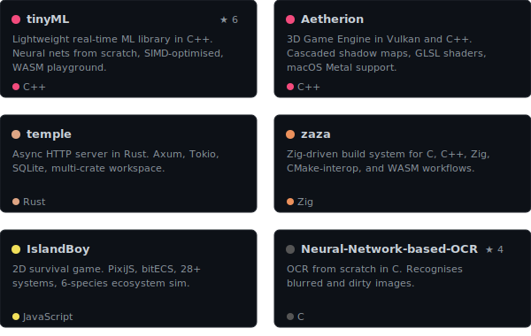
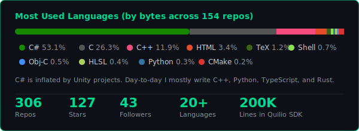

<div align="center">

# Abhishek Shivakumar

**Systems Engineer | Founder @ [Quilio](https://abhishek-shivakumar.com) | Cambridge, UK**

I build engines, instruments, and languages from scratch.

[](https://abhishek-shivakumar.com)
[](https://www.linkedin.com/in/abhishek-shivakumar-899182a6/)
[](https://godofecht.itch.io)
[](https://ko-fi.com/violentsciolist)

</div>

---

<table>
<tr><td valign="top" width="50%">

### What I Do

I run **Quilio**, an audio technology company in Cambridge. We ship commercial audio plugins to **500,000+ musicians** and build the SDKs and ML tools that power them.

Before that I worked on the **Tracktion Engine** with Jules Storer (the guy who made JUCE), co-founded a neurotechnology startup that made it to the **TechStars finals**, and spent years freelancing for audio companies all over the world.

I studied **Neuroscience at Cambridge** and **Music Technology at Birmingham Conservatoire**. I still do research on the side.

</td><td valign="top" width="50%">

### By the Numbers

```
154    public repos
20+    languages shipped in
200K   lines of C++ in the Quilio SDK
500K+  end users across our plugins
20+    commercial products shipped
7+     research papers written
3      game engines, from scratch
2      programming languages designed
1      didgeridoo, electronically excited
```

</td></tr>
</table>

---

### Things I Built From Scratch

<table>
<tr>
<td align="center" width="25%">
<br/>

<br/><br/>
<strong>Umbra Engine</strong>
<br/>
<sub>2D game engine. SDL2, Box2D physics, spatial audio, scripting system, an LLM-playable interface, and 51 built-in example games</sub>
</td>
<td align="center" width="25%">
<br/>

<br/><br/>
<strong><a href="https://github.com/godofecht/Racistherion">Aetherion</a></strong>
<br/>
<sub>3D engine. Vulkan rendering, cascaded shadow maps, GLSL shaders, macOS Metal. I recently added Mac support</sub>
</td>
<td align="center" width="25%">
<br/>

<br/><br/>
<strong><a href="https://github.com/godofecht/IslandBoy">IslandBoy</a></strong>
<br/>
<sub>ECS survival game. PixiJS + bitECS, 28 game systems, 6-species ecosystem sim with predator-prey and weather</sub>
</td>
<td align="center" width="25%">
<br/>

<br/><br/>
<strong><a href="https://github.com/godofecht/temple">Temple</a></strong>
<br/>
<sub>Async HTTP server in Rust. Axum, Tokio, SQLite, crypto, multi-crate workspace</sub>
</td>
</tr>
</table>

<table>
<tr>
<td align="center" width="25%">
<br/>

<br/><br/>
<strong>Quilio SDK</strong>
<br/>
<sub>200K lines of C++. Audio graph with 30+ effects, ML library with neural voice synthesis, hot reload, automated deployment</sub>
</td>
<td align="center" width="25%">
<br/>

<br/><br/>
<strong>Flow</strong>
<br/>
<sub>A programming language I'm designing. v0.7.0. Has a graphics API, autodiff, audio DSP library, and memory management</sub>
</td>
<td align="center" width="25%">
<br/>

<br/><br/>
<strong>Flux</strong>
<br/>
<sub>A Turing-complete graph-rewriting language. Pattern matching on typed port graphs. 16K lines, all tests passing</sub>
</td>
<td align="center" width="25%">
<br/>

<br/><br/>
<strong><a href="https://github.com/godofecht/tinyML">tinyML</a></strong>
<br/>
<sub>ML framework from scratch in C++. CNNs, Transformers, PINNs, GNNs, RL, Bayesian NNs. SIMD-optimised with a WASM playground</sub>
</td>
</tr>
</table>

---

### Research

I like writing papers about things I find interesting. The first one is published. The rest are in progress and available on request.

| Paper | What Happened |
|:------|:-------|
| **Brain-responsive music neurostimulation** | **Published** in the Journal of Neuro Engineering, 2024 |
| **FBIR** (reactive DAG optimisation) | Got a **29x** speedup. In progress |
| **Adaptive Neural Field** (time series) | **R² = 0.9999**. Beat LSTM, Transformers, spiking nets, everything I threw at it. In progress |
| **RCNet** (complex-valued neural networks) | Phase rotation + amplitude modulation. Full ablation study. In progress |
| **ECTM** (energy-constrained thought) | What happens when you give a neural network a metabolism? In progress |
| **Playable Didgeridoo** (NIME 2017) | Fletcher lip valve model. You can physically excite a didgeridoo with speakers. In progress |
| **Proof-Limits** | Programmatic epsilon-delta proofs using interval arithmetic. In progress |

---

### Tech I Use

<div align="center">


</div>

---

### Highlights

<div align="center">
<a href="https://github.com/godofecht/tinyML"><kbd>tinyML</kbd></a> · <a href="https://github.com/godofecht/Racistherion"><kbd>Aetherion (Vulkan 3D)</kbd></a> · <a href="https://github.com/godofecht/temple"><kbd>Temple (Rust)</kbd></a> · <a href="https://github.com/godofecht/zaza"><kbd>Zaza (Zig build)</kbd></a> · <a href="https://github.com/godofecht/IslandBoy"><kbd>IslandBoy</kbd></a> · <a href="https://github.com/godofecht/Neural-Network-based-OCR"><kbd>Neural OCR</kbd></a>
</div>

<br/>

<div align="center">

</div>

---

### Languages & Stats

<div align="center">

</div>

---

<div align="center">
<sub>Cambridge, UK · 12 years building things · abhishek.shivakumar@gmail.com</sub>
</div>
