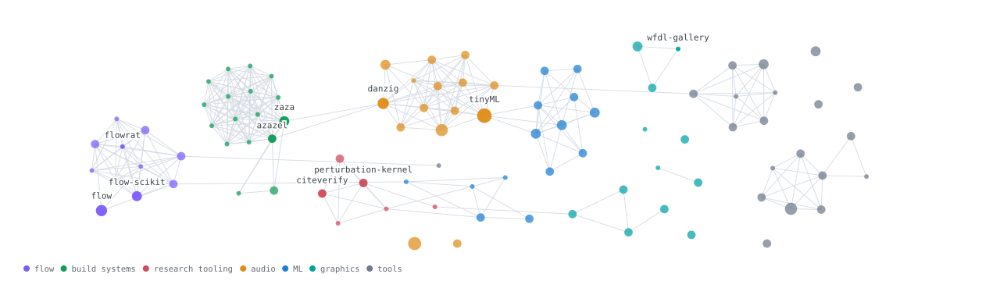

  <picture>
    <source media="(prefers-color-scheme: dark)" srcset="assets/graph-dark.svg">
    
  </picture>

# Abhishek Shivakumar

Compilers, build systems, real-time audio and computational neuroscience.
Cambridge, UK. Founder of [Quilio](https://www.quilio.dev).
Neuroscience at the University of Cambridge, music technology at Birmingham Conservatoire.

    

## Flow

Flow is a statically typed, compiled systems language for programs that evolve through time. Version 1.0 freezes a small production core around the self-hosted `flowc` compiler and a portable C backend. `brew tap flooooooooooow/flow && brew install flow`. Most of what I am building now runs through it.

- **[flow](https://github.com/flooooooooooow/flow)** `3★` The language, the self-hosted `flowc` compiler and the standard library. MIT, at 1.0.2. [(live)](https://flooooooooooow.github.io/flow/)
- **[flow-scikit](https://github.com/godofecht/flow-scikit)** scikit-learn rebuilt in Flow. A 1.4 MB native binary with no Python runtime. [(live)](https://godofecht.github.io/flow-scikit)
- **[flowrat](https://github.com/godofecht/flowrat)** Rat navigation and hippocampal dynamics in real time. The arena is editable while the simulation runs. [(live)](https://godofecht.github.io/flowrat/)
- **[doom-flow](https://github.com/godofecht/doom-flow)** The Doom engine, ported. [(live)](https://godofecht.github.io/doom-flow/)
- **[flow-euler](https://github.com/godofecht/flow-euler)** Project Euler used as a compiler test suite. [(live)](https://godofecht.github.io/flow-euler/)
- **[flow-kernel](https://github.com/flooooooooooow/flow-kernel)** Flow on a Tiny Core Linux base, with cgroups, perf and eBPF underneath.

## Build systems

Two build systems that answer the same question differently. `azazel` states a build as a CUE model and generates Zig from it. `zaza` drives the graph from Zig directly.

- **[azazel](https://github.com/godofecht/azazel)** CUE model in, deterministic Zig build out. No JSON runtime, no flags. [(live)](https://godofecht.github.io/azazel/)
- **[zaza](https://github.com/godofecht/zaza)** C, C++, Zig, CMake interop and WebAssembly, driven from Zig. [(live)](https://godofecht.github.io/zaza/)
- **[azazel-cache](https://github.com/godofecht/azazel-cache)** Content-addressed artifact cache, using GitHub Releases as the store.

Twelve real third-party projects, each built twice, once with `azazel` and once with `zaza`: SQLite, ghostty, libxev, libvaxis, tigerbeetle, zls, river, mach, microzig, capy, zig-gamedev, and the Zig compiler's own tokenizer. [All twelve](https://github.com/search?q=owner%3Agodofecht+topic%3Aazazel-parity&type=repositories)

## Reproducible scientific tooling

Tools for making a result checkable by someone who is not you.

- **[perturbation-kernel](https://github.com/godofecht/perturbation-kernel)** Scalar, SIMD and GPU backends that agree bit for bit. Rust core, five language bindings, on PyPI and crates.io. [(live)](https://godofecht.github.io/perturbation-kernel/)
- **[citeverify](https://github.com/godofecht/citeverify)** Checks every reference in a bibliography against eight bibliographic indexes. Reads BibTeX, RIS, CSL-JSON, .bbl, .docx and PDF.
- **[refereed](https://github.com/godofecht/refereed)** A reviewer panel for a manuscript, running on your own model key.
- **[corpus-lens](https://github.com/godofecht/corpus-lens)** TF-IDF keywords, rhetorical fingerprints and embeddings across a whole corpus.
- **[tilekiln](https://github.com/godofecht/tilekiln)** Procedural texture synthesis with measured parameter stability.

## Audio and real-time

Audio has been the continuous thread. Product work runs through [Quilio](https://www.quilio.dev).

- **[danzig](https://github.com/godofecht/danzig)** `3★` The VST3 C ABI implemented directly in Zig, as extern structs of callconv(.c) function pointers. No JUCE, no Steinberg SDK. [(live)](https://godofecht.github.io/danzig/)
- **[tinyML](https://github.com/godofecht/tinyML)** `7★` A C++ machine-learning and statistics library for embedded and real-time workloads.
- **[isobarcpp](https://github.com/godofecht/isobarcpp)** Daniel Jones' isobar algorithmic music library, in C++.
- **[Analog-Fattener](https://github.com/godofecht/Analog-Fattener)** `4★` An analog fattener effect in JUCE.
- **[Wobblefet](https://github.com/godofecht/Wobblefet)** Pink Trombone, the interactive vocal tract synthesizer, modified.

## Machine intelligence

Learning systems and agent infrastructure, going back to networks written from scratch.

- **[Fractal-Memory-Network](https://github.com/godofecht/Fractal-Memory-Network)** Recursive memory structure for long-running agents.
- **[safe-yolo-agent](https://github.com/godofecht/safe-yolo-agent)** Allowlist permissions for an autonomous coding agent, so destructive calls cannot run unreviewed.
- **[CycleGAN-Timbre-Transfer](https://github.com/godofecht/CycleGAN-Timbre-Transfer)** Timbre transfer through a modified cycle-consistent adversarial network.
- **[Eye-Evolution](https://github.com/godofecht/Eye-Evolution)** Predator-prey eye evolution, using perceptrons and a genetic algorithm.
- **[Disparity-Network](https://github.com/godofecht/Disparity-Network)** Depth from binocular image pairs.
- **[Slow-Feature-Analysis](https://github.com/godofecht/Slow-Feature-Analysis)** Stone and Bray's Slow Feature Analysis, implemented.

## Graphics and things that look like something

- **[wfdl-gallery](https://github.com/godofecht/wfdl-gallery)** A watch dial written as text. 58 faces across seven families, compiled from a small description language. [(live)](https://godofecht.github.io/wfdl-gallery/)
- **[Shadow](https://github.com/godofecht/Shadow)** A 2D game engine kept small enough to read. [(live)](https://godofecht.github.io/Shadow/)
- **[ShaderLibrary](https://github.com/godofecht/ShaderLibrary)** GLSL, Metal and Slang fragment shaders.
- **[cosmographs](https://github.com/godofecht/cosmographs)** The graph at the top of this page. Every repo here, rendered on the GPU. [(live)](https://godofecht.github.io/cosmographs/)
- **[terminal-eye-candy](https://github.com/godofecht/terminal-eye-candy)** Zero-dependency terminal animations in Python.
- **[Hydra-Sketches](https://github.com/godofecht/Hydra-Sketches)** Audio-reactive livecoding for the Hydra video synth.

## Tools and systems

Smaller things that exist because something was annoying.

- **[chromium-tabscroll](https://github.com/godofecht/chromium-tabscroll)** Horizontal tab scrolling for Chromium, rewritten against HEAD after Google removed it in M144.
- **[lpmd](https://github.com/godofecht/lpmd)** LitPro: executable literate programming for any language. [(live)](https://godofecht.github.io/lpmd/)
- **[l1-cache-simulator](https://github.com/godofecht/l1-cache-simulator)** An L1 cache simulator that shows hits, misses and eviction policy as they happen. [(live)](https://godofecht.github.io/l1-cache-simulator/)
- **[pypi-toolkit](https://github.com/godofecht/pypi-toolkit)** `4★` Builds, tests and uploads Python packages.
- **[PrintingCPP](https://github.com/godofecht/PrintingCPP)** Talking to CUPS printers from C++.
- **[DYMO-Labelwriter-App](https://github.com/godofecht/DYMO-Labelwriter-App)** Old DYMO label printers brought back into use.

---

The through line is asking how much of a stack stays necessary once you are willing to change the abstraction underneath it.

There are 97 public repositories here in total. The 60 not listed above are mostly older. [All of them](https://github.com/godofecht?tab=repositories).

Page rebuilt from live repository data on 2026-09-10.
